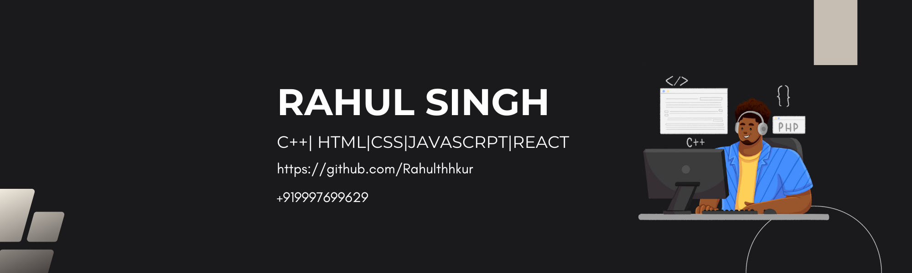

 <h1 align="center">Hi 👋, I'm Rahul Singh</h1>
<h3 align="center">Crafting code, designing interfaces, and building web experiences with precision</h3>

  

- 🌱 I’m currently learning ** Next.js **

- 📫 How to reach me **rthakur1233@gmail.com**

<h3 align="left">Connect with me:</h3>

<h3 align="left">Languages and Tools:</h3>

          

&nbsp;

<a href="https://next.ossinsight.io/widgets/official/compose-currently-working-on?user_id=rahulthhkur&activity_type=all" target="_blank" style="display: block" align="center">
  <picture>
    <source media="(prefers-color-scheme: dark)" srcset="https://next.ossinsight.io/widgets/official/compose-currently-working-on/thumbnail.png?user_id=rahulthhkur&activity_type=all&image_size=auto&color_scheme=dark" width="497.5" height="auto">
  
  </picture>
</a>

